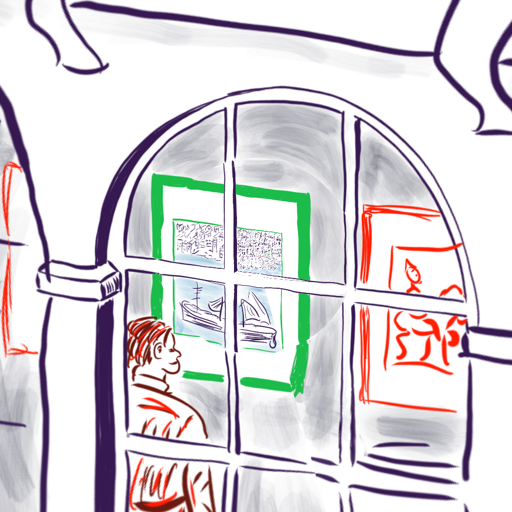
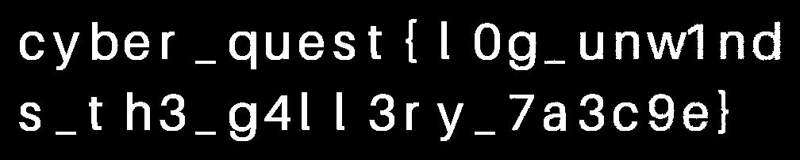

# Print Gallery — organizer solution

**Flag:** `cyber_quest{l0g_unw1nds_th3_g4ll3ry_7a3c9e}`  
**Difficulty:** medium-hard · **Points:** 400 · **Hosting:** H0

## Intended experience

The player receives **only `print-gallery.png`**, inside the challenge ZIP.
It looks like the coloured CindyJS Print Gallery example in its curled
geometry. The title and artwork provide the research lead. No restoration
card, parameter list, reference links, source, or solution is distributed.

Recognize the example → understand its transform → straighten the picture →
inspect the blue bit plane → read the flag. Channel inspection can also
happen first: it reveals curved text that suggests undoing the geometry.
There is no binary byte grid, custom cipher, checksum, or character permutation.



## The actual public transform

The [CindyJS example](https://cindyjs.org/gallery/main/Droste/) samples a
repeated texture through a complex logarithm. Its
[public source](https://github.com/CindyJS/website/blob/master/src/gallery/main/Droste/droste.html)
contains the coefficient and offsets for both geometries. The artwork asset
`Own2.png` is 1196×1360, so define:

```text
a = 1196/1360
C = 2*pi*a
beta = 1 - i*a
S = 0.151 + 0.901i   # straight offset, geometry (1,0)
K = 0.701 + 0.531i   # curled offset, geometry (1,-1)
```

The offsets come directly from the demo's `off`, `corr`, and `offtab`.
The visible artwork area excludes the demo's control panel. It spans
`[-8,4] × [-6,6]`; its spiral centre is `(-2,0)`. Relative to that centre,
the exported square therefore spans `[-6,6] × [-6,6]`.

For pixel centres in an N×N exported image:

```text
z = -6 + 12*(x+0.5)/N + i*(6 - 12*(y+0.5)/N)
```

Let `z` denote a curled-image position and `w` a straight-image position.
Both views refer to the same texture location when:

```text
beta*Log(z)/C - K = Log(w)/C - S
```

Hence the forward position map and its inverse are:

```text
w   = exp(beta*Log(z) + C*(S-K))
z_k = exp((Log(w) + C*(K-S) + 2*pi*i*k)/beta)
```

For each straight output pixel, enumerate `k=-3..3`, keep candidates inside
the curled square, and choose the largest radius. This selects the most
detailed available copy. Sample that location in the handout. There is no
organizer-only phase, random seed, or secret calibration.

The video and Leiden research explain the ideal scale-256 construction.
For this **specific CindyJS artwork**, retain its actual `a=1196/1360` in the
published formula: its sampled texture repeats radially by `exp(2*pi*a)`.
Substituting `ln(256)/(2*pi)` is an approximation, not the exact demo setting.
The geometric mapping is public; bit-plane interpolation must still be
handled correctly for a finite PNG.

## Hide and recover the text

The organizer paints the flag as two ordinary text lines in the approved
straight view. The red and green channels retain the artwork. The blue
channel contains the text mask in bit zero:

```text
blue = (artwork_blue & 254) | text_mask
```

The same coordinates curl both artwork and text. To avoid destroying the
bit-plane, the continuous artwork is interpolated while the discrete mask
uses nearest-neighbour sampling. The released file is a lossless RGB PNG.
The RGB change is at most one level per blue value and is visually subtle.

Players can inspect the blue low bit before or after straightening:

```python
flag_image = (rgb[:, :, 2] & 1) * 255
```

If they straighten RGB first, they must use nearest-neighbour sampling.
Bilinear interpolation mixes integer channel values and damages low bits.
Alternatively, extract the mask first and remap that binary image.



Read left to right, top to bottom, joining the two lines without whitespace.
No ASCII conversion or byte decoding is required. The solver exports the
whole scene and whole bit plane; text crop bounds are found from visible ink.
It needs no knowledge of where the organizer painted the flag.

## Reproduce the solve

See [manual-solve.md](manual-solve.md) for copyable commands that operate on
only the extracted PNG. To use the compact reference implementation:

```sh
python3 admin/solve.py handout/print-gallery.png --output /tmp/gallery-recovered
```

Open `/tmp/gallery-recovered/straightened.png` to see the approved gallery
layout. Open `/tmp/gallery-recovered/flag.png` to read the flag. `solve.py`
imports no builder module, reads no source texture or original JPEG, and
contains no expected flag or text coordinates. It recovers images rather
than pretending to OCR or printing a stored answer.

```sh
bash admin/verify.sh
```

The verification checks source/approval hashes, release structure, an
independent solve in a temporary directory, per-glyph image recovery,
negative controls, deterministic output, and another flag variant. The
rendered result is also inspected visually. Difficulty remains an organizer
target, not a claim of having conducted a blind playtest. A player who
manually traces readable curved letters has found a valid alternate solve.

## Organizer-only hints

1. “The gallery has a version in which the visitor stands in an ordinary window.”
2. “Try the public example's straight geometry `(1,0)` instead of `(1,-1)`.”
3. “A colour value has more than one bit. Check the bottom one in blue.”

## Sources

- [CindyJS demo and research links](https://cindyjs.org/gallery/main/Droste/).
- [CindyJS mapping source](https://github.com/CindyJS/website/blob/master/src/gallery/main/Droste/droste.html).
- [3Blue1Brown: How (and why) to take a logarithm of an image](https://www.youtube.com/watch?v=ldxFjLJ3rVY).
- [Leiden transformation explanation](https://pub.math.leidenuniv.nl/~smitbde/escherdroste/page_menu=symmetry.html).
- [Leiden's reconstruction stages](https://pub.math.leidenuniv.nl/~smitbde/escherdroste/page_menu=steps.html).

The approved source is the site's corrected artwork, not the raw original
Escher scan. Asset attribution is in `deployment/assets/README.md`.
